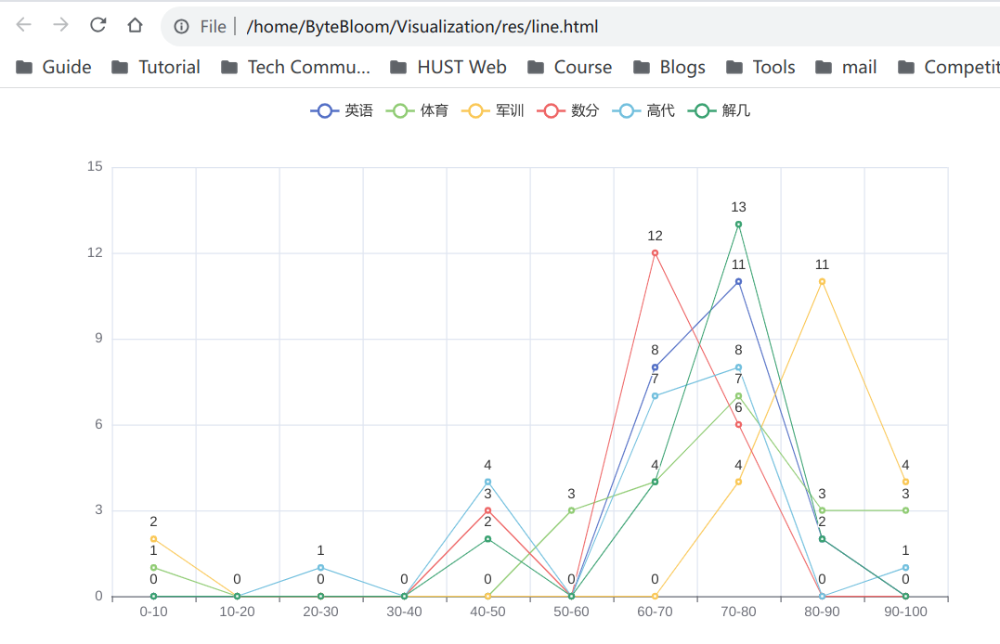

# 作业2

### 1.

```python
import json
from pyecharts import options as opts
from pyecharts.charts import Graph, Page

with open(r"../dataset/weibo.json", "r", encoding="utf-8") as f:
          j = json.load(f)
          nodes, links, categories, cont, mid, userl = j

graph= (Graph()
         .add("", nodes, links, categories, repulsion=50,
             linestyle_opts=opts.LineStyleOpts(curve=0.2),
             label_opts=opts.LabelOpts(is_show=False) )
         .set_global_opts(legend_opts=opts.LegendOpts(is_show=False),
             title_opts=opts.TitleOpts(title="Graph-微博转发关系图")))
graph.render('graph2.html')
```


### 2.

```python
# 搜索百度热搜榜（https://top.baidu.com/board?platform=wise）将前20个热搜词条以词云方式进行展示（热搜排名可以做为字体大小的权重，注意顺序）

from pyecharts import options as opts
from pyecharts.charts import Page, WordCloud
from pyecharts.globals import SymbolType

words = [
    ("年轻人报复性挤爆“3.5分饭店", 40),
    ("男子地铁被诬陷偷拍案一审宣判", 38),
    ("“新三样”展现新优势", 36),
    ("周海媚小区保安证实救护车曾来救人", 34),
    ("流感药药店比医院贵百元 多地发文", 32),
    ("一碗30元的网红面馆卖不动了", 30),
    ("2023年流行趋势风格", 28),
    ("降雪能冻死病毒？", 26),
    ("大批空姐转行卖车？多方回应", 24),
    ("女孩回应被男子问5000元玩不玩", 22),
    ("业主欠800万水费 倾家荡产不够交", 20),
    ("小伙定了婚期才知女方一家全是托", 18),
    ("郑爽被强制执行9050万", 16),
    ("万达380亿元对赌危机解除", 14),
    ("谭飞发文辟谣：周海媚并未过世", 12),
    ("巴西球员比赛中被闪电击中身亡", 10),
    ("薛之谦上上谦火锅仅剩两家", 8),
    ("榜一大哥骗走24名家长1000余万元", 6),
    ("研究发现生两个孩子最有利于长寿", 4),
    ("网传周海媚去世最早爆料者删除内容", 2)
]
wordcloud = (WordCloud()
       .add("", words, word_size_range=[10, 30])# word_size_range为字体大小范围
       .set_global_opts(title_opts=opts.TitleOpts(title="WordCloud-Baidu Hot 20")) )
wordcloud.render('2-2wordcloud.html')
```


### 3.

```python
import pandas as pd
import numpy as np
from pyecharts import options as opts
from pyecharts.charts import Bar, Pie, Line, Page

# Load the data
file_path = '../dataset/student.xls'
data = pd.read_excel(file_path)

# clean the data, if the value is str or null, set it to 0
data = data.fillna(0)
for subject in ['英语', '体育', '军训', '数分', '高代', '解几']:
    data[subject] = data[subject].apply(lambda x: 0 if isinstance(x, str) else x)

data['总分'] = data[['英语', '体育', '军训', '数分', '高代', '解几']].sum(axis=1)

# 1. Bar Chart for Total Scores
bar = Bar()
bar.add_xaxis(data['姓名'].tolist())
bar.add_yaxis("英语", data['英语'].tolist())
bar.add_yaxis("体育", data['体育'].tolist())
bar.add_yaxis("军训", data['军训'].tolist())
bar.add_yaxis("数分", data['数分'].tolist())
bar.add_yaxis("高代", data['高代'].tolist())
bar.add_yaxis("解几", data['解几'].tolist())
bar.set_global_opts(title_opts=opts.TitleOpts(title="Total Scores of All Students"),
                    toolbox_opts=opts.ToolboxOpts(),
                    xaxis_opts=opts.AxisOpts(axislabel_opts=opts.LabelOpts(rotate=-45))
                    )

# 2. Pie Chart for Top 3 Students
top_students = data.nlargest(3, '总分')
page = Page()
for _, student in top_students.iterrows():
    pie = Pie()
    scores = [student['英语'], student['体育'], student['军训'], student['数分'], student['高代'], student['解几']]
    pie.add(student['姓名'], list(zip(['英语', '体育', '军训', '数分', '高代', '解几'], scores)))
    pie.set_global_opts(title_opts=opts.TitleOpts(title=f"Top 3 Student {student['姓名']}"))
    page.add(pie)

# 3. Line Chart for Score Distribution
line = Line()
for subject in ['英语', '体育', '军训', '数分', '高代', '解几']:
    hist, bin_edges = np.histogram(data[subject], bins=range(0, 101, 10))
    line.add_xaxis([f'{int(bin_edges[i])}-{int(bin_edges[i+1])}' for i in range(len(bin_edges)-1)])
    line.add_yaxis(subject, hist.tolist())
    line.set_global_opts(toolbox_opts=opts.ToolboxOpts())

# 4. Comparison of Average Scores
average_scores = data.groupby('性别')[['英语', '体育', '军训', '数分', '高代', '解几']].mean().round(2).T
bar_gender = Bar()
bar_gender.add_xaxis(average_scores.index.tolist())
for gender in average_scores.columns:
    bar_gender.add_yaxis(gender, average_scores[gender].tolist())

# Rendering the charts
bar.render("../res/2-3-1bar.html")
page.render("../res/2-3-2pie.html")
line.render("../res/2-3-3line.html")
bar_gender.render("../res/2-3-4bar_gen.html")
```

#### 图表（按照3.1——3.4顺序依次列出）




